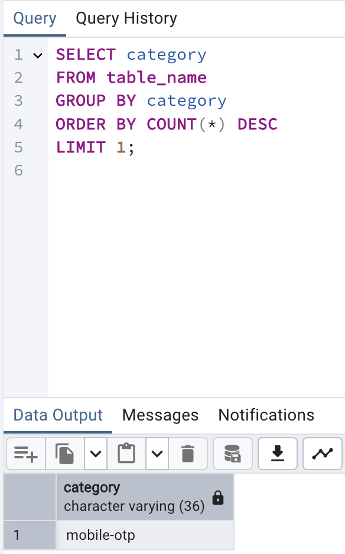
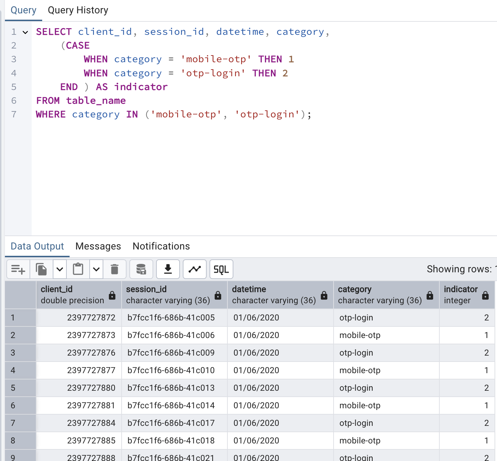
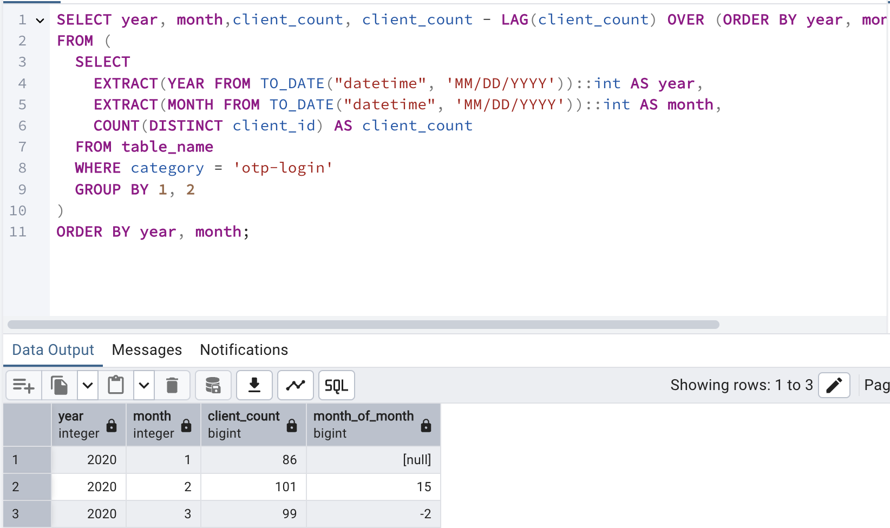
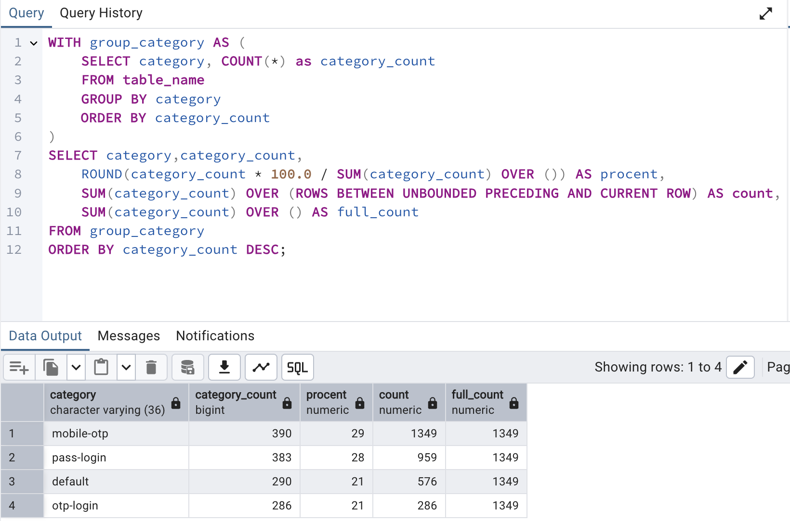

# Задание 1. Показать категорию, по которой было введено наибольшее число кодов за все время

SELECT category
FROM table_name
GROUP BY category
ORDER BY COUNT(*) DESC
LIMIT 1;

Задание 2. 

Добавить индикатор, который будет выделять следующие значения:
•  Если otp для категории мобильная идентификация (mobile), то = 1
•  Если otp для категории логин (login), но не для логина с помощью пароля (pass), то = 2
Все остальные заявки не должны попасть в результат выполнения запроса.

SELECT client_id, session_id, datetime, category,
    (CASE
        WHEN category = 'mobile-otp' THEN 1
        WHEN category = 'otp-login' THEN 2
    END ) AS indicator
FROM table_name
WHERE category IN ('mobile-otp', 'otp-login');

Задание 3. 

Посчитать метрику Month-of-Month (прирост текущего месяца к предыдущему) по уникальным клиентам с кодами otp-login.

SELECT year, month,client_count, client_count - LAG(client_count) OVER (ORDER BY year, month) AS month_of_month
FROM (
  SELECT
    EXTRACT(YEAR FROM TO_DATE("datetime", 'MM/DD/YYYY'))::int AS year,
    EXTRACT(MONTH FROM TO_DATE("datetime", 'MM/DD/YYYY'))::int AS month,
    COUNT(DISTINCT client_id) AS client_count
  FROM table_name
  WHERE category = 'otp-login'
  GROUP BY 1, 2
)
ORDER BY year, month;

Задание 4.  

Одним запросом сформируйте:
•  Количество введённых ОТП кодов в разрезе категории кода ОТП
•  Долю каждой категории по убыванию
•  Количество введённых ОТП с накопительным итогом
•  Общее количество введённых ОТП кодов

WITH group_category AS (
    SELECT category, COUNT(*) as category_count
    FROM table_name
    GROUP BY category
	ORDER BY category_count
)
SELECT category,category_count,
    ROUND(category_count * 100.0 / SUM(category_count) OVER ()) AS procent,
    SUM(category_count) OVER (ROWS BETWEEN UNBOUNDED PRECEDING AND CURRENT ROW) AS count,
    SUM(category_count) OVER () AS full_count
FROM group_category
ORDER BY category_count DESC;

